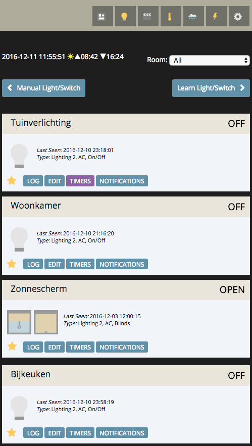

# OsiDark theme for Domoticz
Responsive theme for open source Home Automation System Domoticz - https://www.domoticz.com/

## Please note

This theme is under development and might contains bugs. Make sure you have the latest version.

This theme comes with no warrenty use it at your own risk!

## Intro

Create a Domoticz theme with:

* Simple / clean / flat design layout
* Optimized for smartphone, tablet and desktop
* Large tap area's for buttons on smartphone

## FAQ

### How do I install this theme?

1) Download the theme from the [dist folder](dist/)

2) Add the OsiDark folder into your Domoticz theme folder e.g. /www/styles/

3) In Domoticz goto Setup -> Settings -> Theme and pick OsiDark

or ssh to your Domoticz folder and for the latest release execute:

`mkdir www/styles/osi-dark && wget https://raw.githubusercontent.com/basvdijk/domoticz-osidark-theme/master/dist/OsiDark/custom.css -O www/styles/osi-dark/custom.css`

#### Latest development version

for the latest development version:

`mkdir www/styles/osi-dark && wget https://raw.githubusercontent.com/basvdijk/domoticz-osidark-theme/master/src/OsiDark/custom.css -O www/styles/osi-dark/custom.css`

to update to the latest development version:
`wget https://raw.githubusercontent.com/basvdijk/domoticz-osidark-theme/master/src/OsiDark/custom.css -O www/styles/osi-dark/custom.css`

### I still see the default theme :(

1) Make sure you've cleared your browser cache

2) Make sure you've clicked apply settings

### Your css uses the most ugly selectors possible

I completely agree. Unfortunately Domoticz does not provide classes on the elements, and sometimes has hardcoded styles in the HTML. Therefore I am forced to use these ugly selectors and sometimes even need to use !important.

## Screenshots

### Mobile

### Tablet

### Desktop

